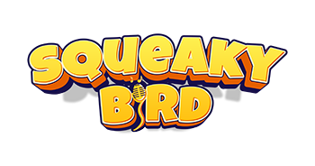
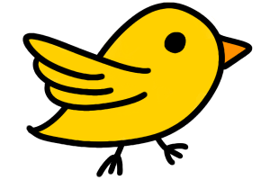

# Hakol-Tov (הקול טוב!) 🎤🐦
### Voice-Controlled Mini-Game Hub for Beit Loewenstein Rehabilitation Center


## 🌟 Overview
**Hakol-Tov** (a play on the Hebrew phrase for "everything is good" and "the voice is good") is a Python-based GUI application developed as a specialized hackathon project for **Beit Loewenstein Rehabilitation Center**. 

The project serves as a therapeutic hub featuring three interactive mini-games controlled entirely by voice and audio input. By modulating pitch and volume, patients engage in a gamified environment that encourages **vocal exercise**, **breath control**, and **speech rehabilitation** in an enjoyable, rewarding way.

---

## 🎮 The Mini-Games

### 1. Squeaky Bird


Navigate the bird through obstacles using your voice. 
* **Mechanic**: Modulation of audio input (squeaks or speech) controls the bird's flight.
* **Visuals**: Uses custom assets including:
  <br>
   
   
  

### 2. Pitch Perfect
Challenge your vocal precision by hitting specific pitch targets.
* **Focus**: Vocal frequency control and accuracy.

### 3. Voice Target
A game focused on hitting specific vocal targets through sustained or varied audio input.

---

## ✨ Features
* **User & Admin Access**: Secure login system with distinct roles.
* **Personalized Thresholds**: Audio sensitivity is tailored to individual users, stored in `thresholds.json` to ensure the games respond accurately to different voices.
* **Comprehensive Leaderboards**: View rankings including cumulative scores, highest scores, and latest performance.
* **Admin Controls**: Specialized dashboard to manage user thresholds and reset leaderboard data.

---

### 🛠️ Installation

**Steps**

1.  **Clone the repository**:
    ```bash
    git clone [https://github.com/your-username/game-hub.git](https://github.com/your-username/game-hub.git)
    cd game-hub
    ```

2.  **Install required libraries**:
    ```bash
    pip install pillow pygame sounddevice numpy scipy
    ```

3.  **Run the application**:
    ```bash
    python main_final.py
    ```

---

### 📁 File Structure

* **`main_final.py`**: The primary GUI and central hub application.
* **`squeaky_bird_final.py`**: Game logic for **Squeaky Bird**.
    * **Assets**: 
         
         
        
* **`pitch_perfect_final.py`**: Game logic for **Pitch Perfect**.
* **`voice_target_final.py`**: Game logic for **Voice Target**.
* **`thresholds.json`**: Stores personalized audio trigger levels for each user.
* **`score.json`**: Current session scoring and game data.
* **`*_leaderboard.json`**: JSON files for persistent score tracking across games.

---

### 📖 Usage

* **Login**: Access the hub using an existing account.
    * **Admin User**: `clinait`
    * **Standard Users**: `shir`, `tom`, `ofri`, `mai`, `shaked`
* **Navigation**: Use the interactive GUI to select a mini-game or check the leaderboards.
* **Gameplay**: Control the games entirely using your voice and microphone input.

---

### 📜 License

This project is licensed under the **MIT License**.
